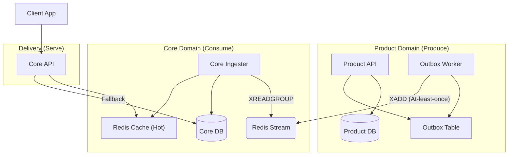

# Home Widget Platform: Architectural Concept

## Executive Summary
The Home Widget Platform is a high-performance, event-driven Server-Driven UI (SDUI) delivery system. It is designed to decouple the high-traffic Home Screen from the complexities and latency of multiple product domain services.

## Core Rationale: The Push Model
Unlike traditional "Pull" models where the Home API aggregates data from N microservices at request time, this platform uses a **Push Model**.

- **Latency Protection**: Core API never makes a synchronous call to a product service. It serves pre-computed widgets from a local hot cache (Redis) or cold storage (Postgres).
- **Graceful Degradation**: If a product service (e.g., Deals) goes down, the Home Screen continues to show the last known good state of those widgets.
- **Asynchronous Decoupling**: Product teams update their own widgets at their own pace.

## Data Flow & Components



### 1. Dual-Write via Transactional Outbox
To ensure eventual consistency without distributed transactions, we use the **Outbox Pattern**.
- Product API saves state and inserts an event into the `outbox` table in a single DB transaction.
- A background `outbox-worker` polls/streams the table and publishes to Redis.
- This guarantees that an event is **always** published if the DB write succeeds.

### 2. Reliable Delivery with Redis Streams
- **XADD**: Events are appended to a persistent stream.
- **Consumer Groups**: The `core-ingester` uses consumer groups for reliable processing.
- **Pending Reclaim**: Ingester periodically runs `XAUTOCLAIM` to find and re-process messages that were never acknowledged (e.g., due to a crash during processing).

### 3. Idempotent Upsert & Versioning
To handle unordered or re-delivered events:
- Every event includes a `data_version`.
- The `core-ingester` uses an **idempotent UPSERT** with a version guard:
  ```sql
  INSERT INTO widgets (...)
  VALUES (...)
  ON CONFLICT (...) DO UPDATE
  SET content = EXCLUDED.content, data_version = EXCLUDED.data_version
  WHERE widgets.data_version < EXCLUDED.data_version;
  ```
- This ensures that stale events never overwrite newer data.

## Read Path Optimization
The `core-api` is designed for maximum throughput:
1. **MGET**: Fetch multiple widgets in a single Redis roundtrip.
2. **Fallback Hierarchy**:
   - Hit Cache (Redis).
   - Miss -> Fetch from Postgres.
   - Populated Cache with TTL from Postgres result.
3. **Multi-layer TTL**:
   - Ingester sets a long TTL (e.g., 7 days) to keep "hot" data ready.
   - API fallback sets a shorter TTL (e.g., 1 hour) to protect against DB thrashing.

## High Availability & Failure Modes

| Failure | Behavior | Recovery |
| :--- | :--- | :--- |
| **Product API Down** | Admin cannot update widgets; User can't save deals. | Core API continues serving last cached state. |
| **Redis Down** | Cache misses; Stream writes buffer in Outbox. | Core API falls back to Postgres; Outbox Worker drains backlog once Redis returns. |
| **Ingester Down** | Backlog builds up in Redis Stream. | Ingester `XAUTOCLAIM` logic processes the backlog on restart. |
| **DB Down** | API returns 500 or serves only from the Hot Cache. | Standard DB replication/failover required. |

## Observability Signals
- **Ingress Lag**: Time between Outbox insertion and Ingester ACK.
- **Cache Hit Rate**: Core API success on Redis MGET.
- **Reclamation Rate**: Number of messages reclaimed via `XAUTOCLAIM` (indicator of process instability).
- **Outbox Backlog**: Size of pending messages in the `outbox` table.
